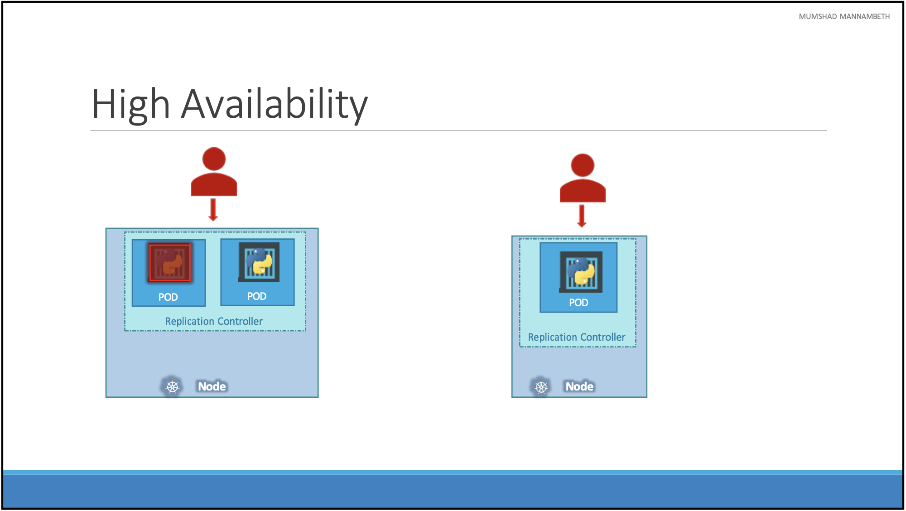
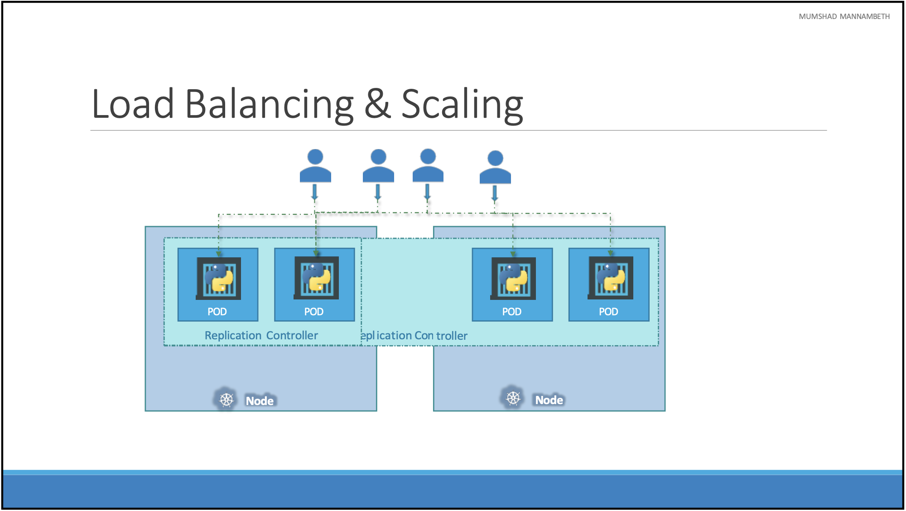
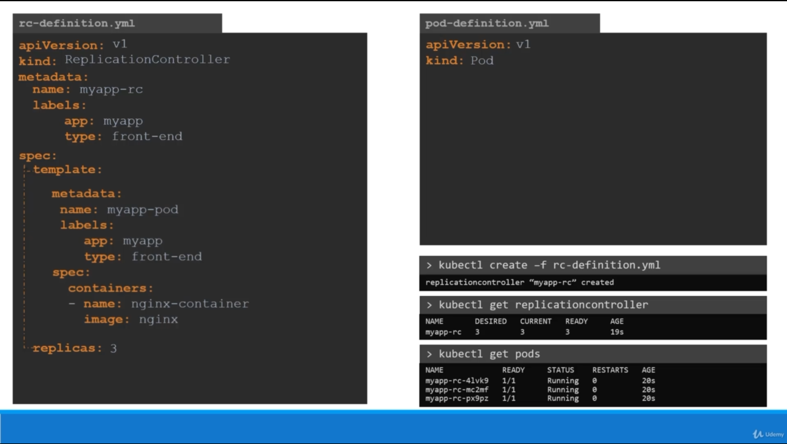
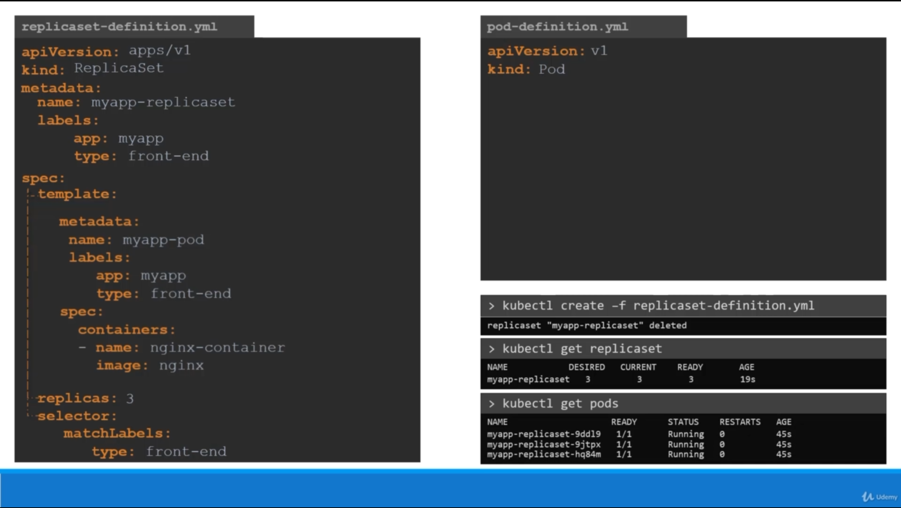
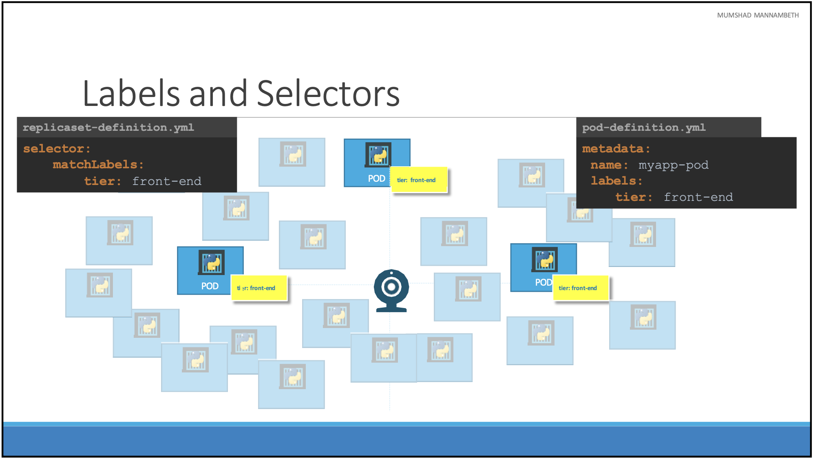
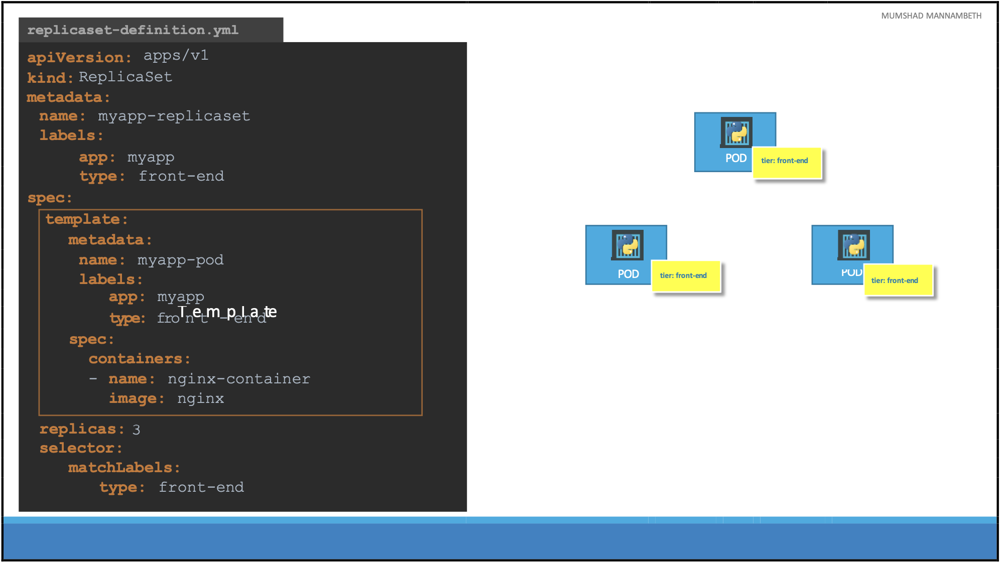
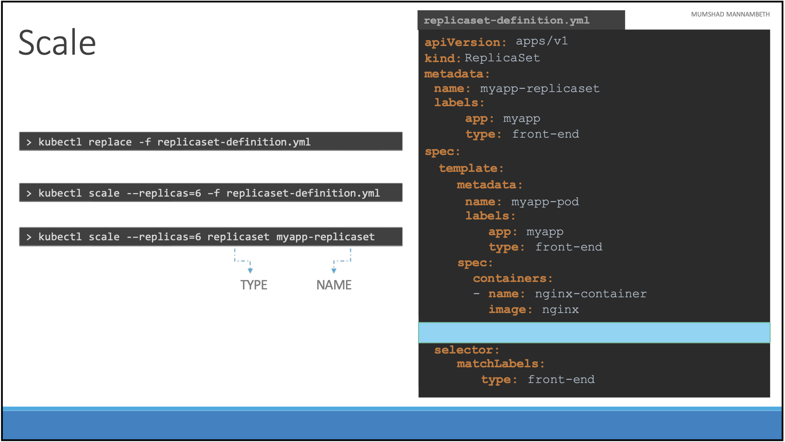
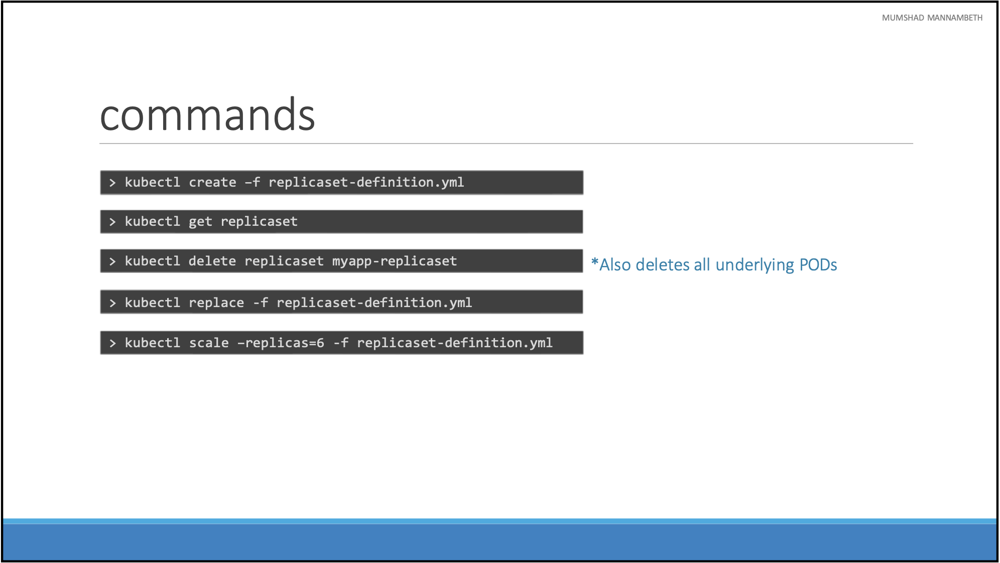

## 1. What is Kubernetes?

Kubernetes, also known as K8s, was built by Google based on their experience running containers in production and released as open source in 2014. It is now an open-source project and is arguably one of the best and most popular container orchestration technologies out there.

To understand Kubernetes, we must first understand two things: `Container` & `Orchestration`.

1. **Container:** A container is an isolated environment for our code. This means that a container has no knowledge of our operating system or our files. Now on the market, the most popular container technology is `Docker`. It runs on the environment provided to us by Docker Desktop. This is why a container usually has everything that our code needs in order to run, down to a base operating system. We can use Docker Desktop to manage and explore our containers.

   ### Why do we need containers?

   1. What if we have a requirement to setup an end-to-end stack including various technologies like a Web Server using Node/Java/Spring/Tomcat, a database such as MongoDB/CouchDB, messaging system like Kafka, a caching system like Redis, and an orchestration tool like Ansible? We might face a lot of issues while developing these applications with all these different components.

      - First, their compatibility with the underlying OS. We have to ensure that all these different services are compatible with the version of the OS we are planning to use. Certain versions of these services might not be compatible with the OS, and we may have to go back and look for another OS that is compatible with all of these different services.

      - Secondly, we shall have to check the compatibility between these services, libraries, and dependencies on the OS. We might have issues where one service requires one version of a dependent library, whereas another service requires another version.

        The architecture of the application might change over time and need upgrading to newer versions of these components, changing the database, etc. And every time something changes, we shall have to go through the same process of checking compatibility between these various components and the underlying infrastructure. This compatibility matrix issue is usually referred to as the matrix from hell.
        

   2. Every time when we need a new developer on board, it is really difficult to setup a new environment. The new developers will have to follow a large set of instructions and run hundreds of commands to finally setup their environments. They have to make sure that they are using the right Operating system and the right versions of each of these components.

   3. We will also have different development, test, and production environments. One developer may be comfortable using one OS, and the others may be using another one, so we couldn’t guarantee that the application that we were building would run the same way in different environments. And so all of this made our lives in developing, building, and shipping the application really difficult.

   ### Solution for the above problems

   We can containerize the application. Run each service with its own dependencies in separate containers.
   

   So we needed something that could help us with the compatibility issue. And something that will allow us to modify or change these components without affecting the other components, and even modify the underlying operating systems as required. And to fulfil these requirements, we can go for `Docker`. With Docker, we can run each component in a separate container with its own libraries and its own dependencies. All on the same VM and OS, but within separate environments or containers. We just have to build the docker configuration once, and all the developers can now get started with a simple `docker run` command, irrespective of what underlying OS they run. All they need to do is make sure they have Docker installed on their systems.

   So we can say Containers are completely isolated environments, as in they can have their own processes or services, their own network interfaces, and their own mounts, just like Virtual machines, except that they all share the same OS kernel. Containers are not new with Docker. Containers have existed for about 10 years now, and some of the different types of containers are `LXC`, `LXD` , `LXCFS` etc. Docker utilises LXC containers. Setting up these container environments is hard as they are very low level and that is where Docker offers a high-level tool with several powerful functionalities, making it really easy for end users like us.

   ### How Docker works

   To understand how Docker works, let us first revisit some basic concepts of Operating systems.
   
   If we look at operating systems like `Ubuntu`, `Fedora`, `Suse, or `Centos`. They all consist of two things. An `OS Kernel` and a set of software. The OS Kernel is responsible for interacting with the underlying hardware. While the OS kernel remains the same, which is Linux in this case, it’s the software above it that makes these Operating Systems different. This software may consist of a different User Interface, drivers, compilers, File managers, developer tools, etc. So we have a common Linux Kernel shared across all Operating Systems and some custom software that differentiates Operating systems from each other.

   ### Sharing the Kernel means?

   Let’s say we have a system with an Ubuntu OS with Docker installed on it.
   
   Docker can run any flavour of OS on top of it as long as they are all based on the same kernel. In this case, it is a Linux-based kernel. If the underlying OS is Ubuntu, Docker can run a container based on another distribution like Debian, Fedora, Suse or Centos. Each docker container only has the additional software, that makes these operating systems different and docker utilises the underlying kernel of the Docker host which works with all OSs above.

   So what if an OS does not share the same kernel as these? For example, Windows OS. So we won't be able to run a Windows-based container on a Docker host with a Linux OS on it. For that, we would require Docker on a Windows server. Isn’t that a disadvantage, then? Not being able to run another kernel on the OS? The answer is No! Because unlike `hypervisors`, Docker is not meant to virtualize and run different Operating systems and kernels on the same hardware. The main purpose of Docker is to containerize applications, ship them, and run them.

   ### Containers vs Virtual Machines

   
   As we can see on the right, in the case of Docker, we have the underlying hardware infrastructure, then the OS, and Docker installed on the OS. Docker then manages the containers that run with libraries and dependencies alone.

   In the case of a Virtual Machine, we have the OS on the underlying hardware, then the `Hypervisor`, like an ESX or virtualization of some kind, and then the virtual machines. As we can see, each virtual machine has its own OS inside it, then the dependencies, and then the application.

   - This overhead causes higher utilisation of underlying resources as there are multiple virtual operating systems and kernels running.
   - The virtual machines also consume more disc space as each VM is heavy and is usually in gigabytes in size, whereas Docker containers are lightweight and are usually in megabytes in size.
   - This allows Docker containers to boot up faster, usually in a matter of seconds, whereas VMs, as we know, take minutes to boot up as they need to boot up the entire OS.
   - It is also important to note that Docker has less isolation as more resources are shared between containers, like the kernel, etc. Whereas VMs have complete isolation from each other.
   - Since VMs don’t rely on the underlying OS or kernel, we can run different types of OS, such as Linux-based or Windows-based, on the same hypervisor.

   ### How to use Docker?

   There are a lot of containerized versions of applications readily available today. So most organisations have their products containerized and available in a public Docker registry called `dockerhub` already. For example, we can find images of the most common operating systems, databases, and other services and tools. Once we identify the images we need, we just need to use some commands to run the respective image.
   
   This command, `docker run ansible`, will run an instance of Ansible on the docker host. Similarly, we can run an instance of MongoDB, Redis, or NodeJS using the `docker run` command. If we need to run multiple instances of the web service, simply add as many instances as we need and configure a load balancer of some kind in the front.

   ### Container vs Image

   An image is a package or a template, just like a VM template that is used in the virtualization world. It is used to create one or more containers. Containers are running instances of images that are isolated and have their own environments and set of processes.
   

   ### Container Advantage

   Traditionally, developers develop applications, then hand them over to the operations team to deploy and manage them in production environments. They do that by providing a set of instructions, such as information about how the hosts must be setup, what pre-requisites are to be installed on the host, how the dependencies are to be configured, etc.
   
   Since the Ops team did not develop the application on their own, they struggled with setting it up. When they hit an issue, they work with the developers to resolve it.

   With Docker, a major portion of the work involved in setting up the infrastructure is now in the hands of the developers in the form of a Docker file. The guide that the developers built previously to setup the infrastructure can now be easily put together into a `Dockerfile` to create an image for their applications.
   
   This image can now run on any container platform and is guaranteed to run the same way everywhere. So the Ops team can now simply use the image to deploy the application. Since the image was already working when the developer built it and operations are not modifying it, it continues to work the same when deployed in production.

   So as we know about containers, we now have our application packaged into a Docker container. But what next?

   - How do we run it in production?
   - What if our application relies on other containers, such as databases, messaging services, or other backend services?
   - What if the number of users increases and we need to scale our application?
   - We would also like to scale down when the load decreases.

   To enable these functionalities, we need an underlying platform with a set of resources. The platform needs to orchestrate (arrange/organise) the connectivity between the containers and automatically scale up or down based on the load. This whole process of automatically deploying and managing containers is known as `Container Orchestration`.

2. **Orchestration:** Kubernetes is thus a container orchestration technology. There are multiple such technologies available today. `Docker` has its own tool called `Docker Swarm`. `Kubernetes` from `Google` and `Mesos` from `Apache`.
   
   While Docker Swarm is really easy to setup and get started with, it lacks some of the advanced autoscaling features required for complex applications. Mesos, on the other hand, is quite difficult to setup and get started, but it supports many advanced features. Kubernetes is arguably the most popular of them all, but it is a bit difficult to setup and get started. It provides a lot of options to customise deployments and supports the deployment of complex architectures. Kubernetes is now supported on all public cloud service providers like GCP, Azure, and AWS, and the Kubernetes project is one of the top-ranked projects on Github.

**Kubernetes Advantage:**
There are various advantages to container orchestration.


- Our application is now highly available, as hardware failures do not bring the application down because we have multiple instances of the application running on different nodes.
- The user traffic is load-balanced across the various containers. When demand increases, we can deploy more instances of the application seamlessly within a matter of seconds, and we have the ability to do that at a service level.
- When we run out of hardware resources, we can scale the number of nodes up or down without having to take down the application, and we can do all of this easily with a set of declarative object configuration files.

And that is Kubernetes. It is a container Orchestration technology used to orchestrate the deployment and management of 100s and 1000s of containers in a clustered environment.

## 2. Kubernetes Architecture

Before we head into setting up a kubernetes cluster, it is important to understand some of the basic concepts. This is to make sense of the terms that we will come across while setting up a kubernetes cluster.

- **Nodes(Minions):** A node is a machine (physical or virtual) on which Kubernetes is installed. A node is a worker machine, and this is where containers will be launched by Kubernetes. It was also known as Minions in the past.
  
  _But what if the node on which our application is running fails?_ Well, obviously, our application goes down. So we need to have more than one node.
- **Cluster:** A cluster is a set of nodes grouped together. This way, even if one node fails, our application is still accessible from the other nodes. Moreover, having multiple nodes helps in sharing loads as well.
  
- **Master:** Now we have a cluster, but...

  - Who is responsible for managing the cluster?
  - Where is the information about the members of the cluster stored?
  - How are the nodes monitored?
  - When a node fails, how do we move the workload of the failed node to another worker node?

  That’s where the `Master` comes in. The master is another node with Kubernetes installed in it, and is configured as a Master. The master watches over the nodes in the cluster and is responsible for the actual orchestration of containers on the worker nodes.
  

- **Components of Kubernetes:** When we install Kubernetes on a System, we are actually installing the following components.
  

  - **API Server:** The API server acts as the front-end for kubernetes. The users, management devices, command line interfaces all talk to the API server to interact with the kubernetes cluster.
  - **ETCD service:** ETCD is a distributed, reliable key-value store used by Kubernetes to store all the data used to manage the cluster. Think of it this way: when we have multiple nodes and multiple masters in our cluster, etcd stores all the information on all the nodes in the cluster in a distributed manner. ETCD is responsible for implementing locks within the cluster to ensure there are no conflicts between the Masters.
  - **Schedulers:** The scheduler is responsible for distributing work or containers across multiple nodes. It looks for newly created containers and assigns them to Nodes.
  - **Controllers:** The controllers are the brains behind orchestration. They are responsible for noticing and responding when nodes, containers, or endpoints go down. The controllers make decisions to bring up new containers in such cases.
  - **Container Runtime:** The container runtime is the underlying software that is used to run containers. In our case, it happens to be `Docker`.
  - **kubelet service:** kubelet is the agent that runs on each node in the cluster. The agent is responsible for making sure that the containers are running on the nodes as expected.

- **Master vs Worker Nodes:**
  The worker node (minion) is hosted in the container. For example,  to run Docker containers on a system, we need the container runtime installed. And that’s where the container runtime falls. In this case, we are using `Docker`. This doesn’t have to be Docker. There are other container runtime alternatives available, such as `Rocket` or `CRIO`.
  

  - The master server has the `kube-apiserver`, and that is what makes it a Master.
  - Similarly, the worker nodes have the `kubelet` agent that is responsible for interacting with the master to provide health information about the worker node and carry out actions requested by the master on the worker nodes.
  - All the information gathered is stored in a key-value store on the Master. The key value store is based on the popular `etcd` framework.
  - The master also has the controller manager and the scheduler.

  **Note:** There are other components as well. The reason we went through this was to understand what components constitute the master and worker nodes. This will help us install and configure the right components on different systems when we set up our infrastructure.

- **kubectl:** The kube control tool is used to deploy and manage applications on a kubernetes cluster, to get cluster information, to get the status of nodes in the cluster and many other things.
  

## 3. POD Introduction

_**Prerequisite:** Before we head into understanding PODs, we would like to assume that the following have been setup already: At this point, we assume that the application is already developed and built into Docker Images and is available on a Docker repository like Docker Hub, so Kubernetes can pull it down. We also assume that the Kubernetes cluster has already been set up and is working. This could be a single-node setup or a multi-node setup; it doesn’t matter. All the services need to be running._

As we discussed before, with Kubernetes, our ultimate aim is to deploy our application in the form of containers on a set of machines that are configured as worker nodes in a cluster. However, Kubernetes does not deploy containers directly on the worker nodes. The containers are encapsulated into a Kubernetes object known as `PODs`. A `POD` is a single instance of an application. A POD is the smallest object that we can create in Kubernetes.

Here we see the simplest of the simplest cases where we can have a single-node Kubernetes cluster with a single instance of our application running in a single Docker container encapsulated in a POD.

- What if the number of users accessing our application increases and we need to scale our application? We need to add additional instances of our web application to share the load.
- Now, where would we spin up additional instances?
- Do we bring up a new container instance within the same POD? No! We create a new POD altogether with a new instance of the same application. As we can see now, we have two instances of our web application running on two separate PODs on the same Kubernetes system or node.
- What if the user base further increases and our current node has insufficient capacity? Well, then we can always deploy additional PODs on a new node in the cluster. We will have a new node added to the cluster to expand its physical capacity.
- What does it mean? PODs usually have a one-to-one relationship with containers running our application. To scale up, we create new PODs, and to scale down, we delete PODs. We do not add additional containers to an existing POD to scale our application.

**Multi-Container PODs:** Now, we just said that PODs usually have a one-to-one relationship with the containers, but are we restricted to having a single container in a single POD? No! A single POD CAN have multiple containers, except for the fact that they are usually not multiple containers of the same kind.

As we discussed in the previous slide, if our intention was to scale our application, then we would need to create additional PODs. But sometimes we might have a scenario where we have a helper container that is doing some kind of supporting task for our web application, such as processing user-entered data, processing a file uploaded by the user, etc., and we want these helper containers to live along side of our application container. In that case, we can have both of these containers part of the same POD, so that when a new application container is created, the helper is also created, and when it dies, the helper also dies since they are part of the same POD.

The two containers can also communicate with each other directly by referring to each other as `localhost` since they share the same network namespace. Plus, they can easily share the same storage space.

**POD Understanding from a different angle:** Let’s, for a moment, keep Kubernetes out of our discussion and talk about simple Docker containers. Let’s assume we were developing a process or a script to deploy our application on a Docker host. Then we would first simply deploy our application using a simple `docker run python-app` command, and the application would run fine and our users would be able to access it. When the load increases, we deploy more instances of our application by running the docker run commands many more times. This works fine, and we are all happy.

Now, sometime in the future, our application will be further developed, undergo architectural changes, and grow and get more complex. We now have new helper containers that help our web applications by processing or fetching data from elsewhere. These helper containers maintain a one-to-one relationship with our application containers and, thus, need to communicate with the application containers directly and access data from those containers.

- For this, we need to maintain a map of what apps and helper containers are connected to each other.
- We would need to establish network connectivity between these containers ourselves using links and custom networks.
- We would need to create shareable volumes, share them among the containers, and maintain a map of that as well.
- And most importantly, we would need to monitor the state of the application container and, when it dies, manually kill the helper container as well, as it is no longer required.
- When a new container is deployed, we would need to deploy the new helper container as well.

With PODs, Kubernetes does all of this for us automatically. We just need to define what containers a POD consists of, and the containers in a POD by default will have access to the same storage, the same network namespace, and the same fate, as they will be created and destroyed together. Even if our application didn’t happen to be so complex and we could live with a single container, Kubernetes still requires us to create PODs. But this is good in the long run, as our application is now equipped for architectural changes and scale in the future.

**How to deploy PODs:** Earlier, we learned about the kubectl run command. What this command really does is deploy a Docker container by creating a POD. So it first creates a POD automatically and deploys an instance of the nginx Docker image. But where does it get the application image from? For that, we need to specify the image name using the `–-image` parameter.

The application image, in this case the `nginx` image, is downloaded from the `docker hub` repository. Docker Hub, as we discussed, is a public repository where the latest Docker images of various applications are stored. We could configure Kubernetes to pull the image from the public Docker hub or a private repository within the organisation.

Now that we have a POD created, how do we see the list of PODs available? The `kubectl get pods` command helps us see the list of pods in our cluster. In this case, we see the pod is in a `ContainerCreating` state and soon changes to a `Running` state when it is actually running.

## 4. POD Configuration

Kubernetes uses YAML files as input for the creation of objects such as PODs, Replicas, Deployments, Services etc. All of these follow similar structure. A Kubernetes definition file always contains 4 top-level fields. The `apiVersion`, `kind`, `metadata` and `spec`. These are top-level or root-level properties. These are all required fields, so we must have them in our configuration file.


- **apiVersion:** This is the version of the Kubernetes API we’re using to create the object. Depending on what we are trying to create we must use the right apiVersion. The possible values for this field could be v1, apps/v1, apps/v1beta1, extensions/v1beta1, etc.

- **kind:** The kind refers to the type of object we are trying to create. Some possible values could be `Pod`, `ReplicaSet`, `Deployment` or `Service`.

- **metadata:** The metadata is data about the object like its name, labels etc. As we can see unlike the first two(apiVersion & kind) we specified a string value. This is in the form of a dictionary. So everything under metadata is intended to the right a little bit and so `name` and `labels` are children of metadata.

  Under metadata, the `name` is a string value. So we can name our POD `myapp-pod` and the `labels` is a dictionary. So labels is a dictionary within the metadata dictionary and it can have any key and value pairs as we wish. For now, we have added a label app with the value `myapp`. Similarly, we could add other labels as we see fit which will help us to identify these objects at a later point in time. Say for example there are 100s of PODs running a front-end application and 100’s of them running a backend application or a database. It will be difficult to group these PODs once they are deployed. If we label them as front-end, back-end or database, we will be able to filter the PODs based on this label at a later point in time.

  It’s important to note that under metadata, we can only specify `name`, `labels` or anything else that Kubernetes expects to be under metadata. We cannot add any other property as we wish under this. However, under `labels`, we can have any kind of key or value pairs as we see fit.

- **spec:** So far we have only mentioned the type and name of the object we need to create which happens to be a POD with the name `myapp-pod` but we haven’t specified the container or image we need in the pod. The last section in the configuration file is the specification which is written as `spec`. Depending on the object we are going to create, this is where we provide additional information to Kubernetes about that object.

  Spec is a dictionary so add a property under it called `containers` which is a list or an array. The reason this property is a list is because the PODs can have multiple containers within them. In this case, we will only add a single item to the list, since we plan to have only a single container in the POD. The item in the list is a dictionary, so add a name and image property. The value for `image` is nginx.

Once the file is created, run this command to create the POD.

```
kubectl create -f pod-definition.yml
```

Once we create the pod, how do you see it? Use the `kubectl get pods` command to see a list of pods available. In this case, it's just one. To see detailed information about the pod run the `kubectl describe pod` command. This will tell the information about the POD, when it was created, what labels are assigned to it, what docker containers are part of it and the events associated with that POD.


## 5. Replication Controller

Controllers are the brain behind Kubernetes. Controllers are the processes that monitor Kubernetes objects and respond accordingly and one of the controllers is the Replication Controller.

### What is a replica and why do we need a replication controller?

Let’s go back to our first scenario where we had a single POD running our application. What if for some reason, our application crashes and the POD fails? Users will no longer be able to access our application. To prevent users from losing access to our application, we would like to have more than one instance or POD running at the same time. That way if one fails we still have our application running on the other one. The replication controller helps us to run multiple instances of a single POD in the Kubernetes cluster thus providing High Availability.


So does that mean we can’t use a replication controller if we plan to have a single POD? No! Even if we have a single POD, the replication controller can help by automatically bringing up a new POD when the existing one fails. Thus the replication controller ensures that the specified number of PODs are running at all times. Even if it’s just 1 or 100. Another reason we need a replication controller is to create multiple PODs to share the load across them. For example, in this simple scenario, we have a single POD serving a set of users. When the number of users increases we deploy additional POD to balance the load across the two pods. If the demand further increases and if we were to run out of resources on the first node, we could deploy additional PODs across other nodes in the cluster.

As we can see, the replication controller spans across multiple nodes in the cluster. It helps us balance the load across multiple pods on different nodes as well as scale our application when the demand increases.

It’s important to note that there are two similar terms. `Replication Controller` and `Replica Set`. Both have the same purpose but they are not the same. The Replication Controller is the older technology that is being replaced by the Replica Set. Replica set is the new recommended way to set up replication. However, whatever we discussed in the previous few slides remains applicable to both these technologies. There are minor differences in the way each works.

### Create Replication Controller

As with any Kubernetes definition file, we will have 4 sections. The `apiVersion`, `kind`, `metadata` and `spec`. The `apiVersion` is specific to what we are creating. In this case, the replication controller is supported in Kubernetes apiVersion `v1`. So we will write it as v1. The `kind` as we know is `ReplicationController`. Under `metadata`, we will add a `name` and we will call it `myapp-rc`. We will also add a few `labels`: `app` & `type` and assign values to them. So far, it has been very similar to how we created a POD in the previous section. The next is the most crucial part of the definition file and that is the specification written as `spec`. For any Kubernetes definition file, the `spec` section defines what’s inside the object we are creating. In this case, we know that the replication controller creates multiple instances of a POD but which POD?

We create a `template` section under `spec` to provide a POD template to be used by the replication controller to create replicas. Now how do we define the POD template? It’s not that hard because we have already done that in the previous exercise. Remember, we created a `pod-definition` file in the previous exercise. We could reuse the contents of the same file to populate the template section. Move all the contents of the `pod-definition` file into the `template` section of the replication controller, except for the first two lines which are `apiVersion` & `kind`. Remember whatever we move must be under the `template` section. Meaning, they should be intended to the right and have more spaces before them than the template line itself.

Looking at our file, we now have two metadata sections – one is for the Replication Controller and another for the POD and we have two spec sections – one for each. We have nested two definition files together. The replication controller is the parent and the pod-definition is the child.

Now, there is something still missing. We haven’t mentioned how many replicas we need in the replication controller. For that, add another property to the `spec` called `replicas` and input the number of replicas we need under it. Remember that the template and replicas are direct children of the `spec` section. So they are siblings and must be on the same vertical line having an equal number of spaces before them.

Once the file is ready, run the `kubectl create` command and input the file using the `–f` parameter. The replication controller is created. When the replication controller is created it first creates the PODs using the pod-definition `template` as many as required, which is 3 in this case. To view the list of created replication controllers run the `kubectl get replicationcontroller` command and we will see the replication controller listed. We can also see the desired number of replicas or pods, the current number of replicas and how many of them are ready. If you would like to see the pods that were created by the replication controller, run the `kubectl get pods` command and we will see 3 pods running. Note that all of them start with the name of the replication controller which is `myapp-rc` indicating that they are all created automatically by the replication controller.

## 6. Replica Set

It is very similar to a replication controller. As usual, first we have `apiVersion`, `kind`, `metadata` and `spec`. The `apiVersion` though is a bit different. It is `apps/v1` which is different from what we had before for the replication controller. For the replication controller, it was simply `v1`. If we write `v1` for the replica set, we are likely to get an error that would say `no matches for Kind ReplicaSet`, because the specified Kubernetes API version(v1) has no support for ReplicaSet.

The `kind` would be `ReplicaSet` and we add `name` & `labels` in `metadata`. The specification section looks very similar to the replication controller. It has a template section where we provide pod-definition as before. So we can copy the contents from the pod-definition file. And we have 3 replica sets. However, there is one major difference between the replication controller and the replica set. The replica set requires a `selector` definition. The `selector` section helps the replicaset to identify what pods fall under it. But why would we have to specify what PODs fall under it if we have provided the contents of the pod-definition file itself in the template? It’s because the replica set can also manage the pods that were not created as part of the replica set creation. Say, for example, there were pods created before the creation of the ReplicaSet that match the labels specified in the selector, the replica set will also consider those pods when creating the replicas.

`Selector` is one of the major differences between the replication controller and the replica set. The `selector` is not a required field in case of a replication controller, but it is still available. When we skip it, as we did in the previous slide, it is assumed to be the same as the labels provided in the pod-definition file. In case of the replica set, user input is required for this property and it has to be written in the form of `matchLabels` as shown above. The `matchLabels` selector simply matches the labels specified under it to the labels on the PODs. The replica set selector also provides many other options for matching labels that were not available in a replication controller. As always to create a ReplicaSet run the `kubectl create` command by providing the definition file as input. To see the created replicasets run the `kubectl get replicaset` command. To get a list of pods, simply run the `kubectl get pods` command.

## 7. Labels and Selectors

So what is the deal with Labels and Selectors? Why do we label our PODs and objects in Kubernetes? Let us look at a simple scenario.

Say we deployed 3 instances of frontend web application as 3 PODs. We would like to create a replication controller or replica set to ensure that we have 3 active PODs at any time. The role of the replicaset is to monitor the pods and if any of them were to fail, deploy new ones. The replica set is indeed a process that monitors the pods. Now, how does the replica set know what pods to monitor? There could be 100s of other PODs in the cluster running different applications. This is where labeling our PODs during creation comes in handy. We could now provide these labels as a filter for replicaset. Under the selector section, we use the matchLabels filter and provide the same label that we used while creating the pods. This way the replicaset knows which pods to monitor.

In the replicaset specification section, we learned that there are 3 sections: `template`, `replicas` and `selector`. We need 3 replicas and we have updated our selector based on our discussion in the previous slide. Say for instance we have the same scenario as in the previous slide where we have 3 existing PODs that were created already and we need to create a replica set to monitor the PODs to ensure there are a minimum of 3 running PODs at all times. When the replication controller is created, it is not going to deploy a new instance of POD as 3 of them with matching labels are already created. In that case, do we really need to provide the `template` section in the replica-set specification since we are not expecting the replica set to create a new POD on deployment?

Yes we need to provide it because in case one of the PODs were to fail in the future, the replicaset needs to create a new one to maintain the desired number of PODs. And, for the replica set to create a new POD, the template definition section IS required.

## 8. Scale

Let’s look at how we scale the replicaset. Say we started with 3 replicas and in the future, we decide to scale to 6. How do we update our replica set to scale to 6 replicas. Well, there are multiple ways to do it. The first is to update the number of replicas in the definition file to 6. Then run the `kubectl replace` command specifying the same file using the `–f` parameter and that will update the replicaset to have 6 replicas.

The second way is to run the `kubectl scale` command. Use the `--replicas` parameter to provide the new number of replicas and specify the same file as input. We may either input the definition file or provide the `replicaset` name in the `TYPE` `NAME` format. However, remember that using the file name as input will not result in the number of replicas being updated automatically in the file. In other words, the number of replicas in the `replicaset-definition.yml` file will still be 3 even though we scaled our replicaset to have 6 replicas using the `kubectl scale` command and the file as input. There are also options available for automatically scaling the replicaset based on load.


- The `kubectl create` command, as we know, is used to create a `replcaset`. We must provide the input file using the `–f` parameter.
- Use the `kubectl get` command to see the list of replica sets created.
- Use the `kubectl delete replicaset` command followed by the name of the replica set to delete the replica set.
- And then we have the `kubectl replace` command to replace or update the replicaset.
- The `kubectl scale` command to scale the replicas simply from the command line without having to modify the file.
